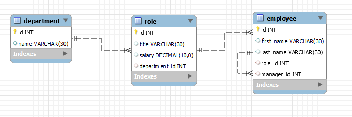
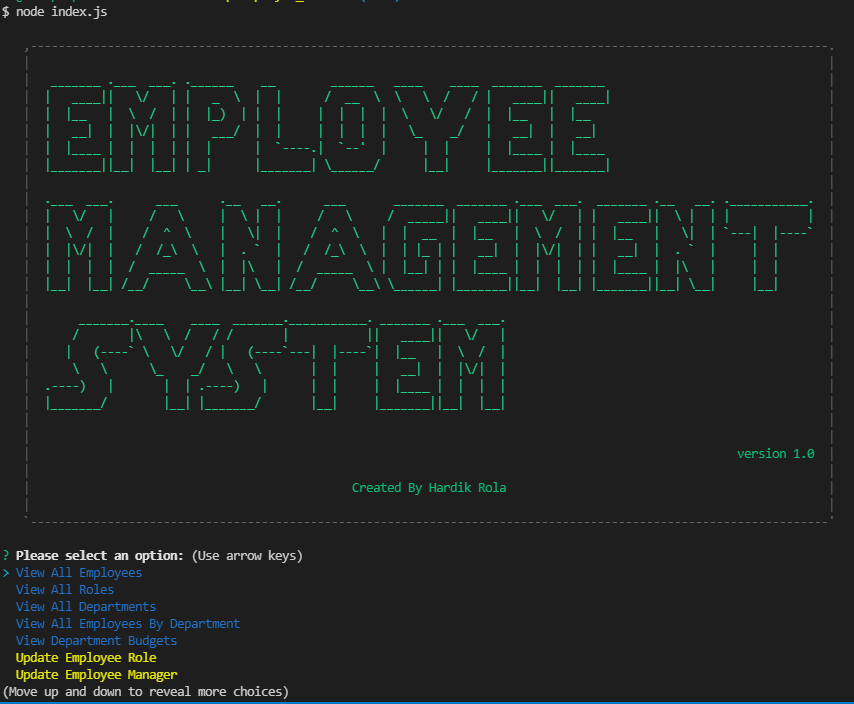
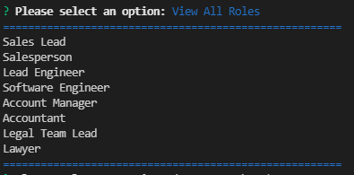
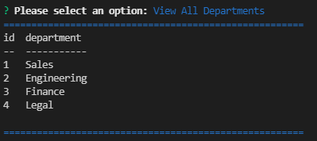
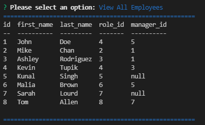

<h1 align = "center">Employee Management Tracker </h1>

---

1. [Description](#desc)
2. [Web Address](#webaddress)
3. [Usage Tips](#usage)
4. [Features](#feature)
5. [Install Command](#command)
6. [Credits](#credits)
7. [Licenses](#licenses)
8. [Questions and Contributing](#qnacontri)

---

## Description

This node.js app allows the user to easily store data about their employee's, departments and roles.

---

## Web Address

This app is terminal based. Hence, there is no front end available. In order to run the application please see install command and Usage Tips sections.

---

## Usage Tips

### Employee Tracker to run locally perform the below step:-

- Download the Repo as ZIP file or clone it locally
- Open the repo folder to your favorite code editor
- install the dependency (listed in Install Command)
- run node index.js in your terminal

### Employee Tracker Allows user to:-

- View all Employees, Roles, and Departments
- Update an Employee's Role, Employee's Manager
- Add a new Employee, Role, and Department
- Delete a Employee, Role, and Department

---

## App Features

### Database Design

### Video Tutorial

### Screenshots

Start Menu  

|           View all Roles           |        View all Department        |          View all Employee           |
| :--------------------------------: | :-------------------------------: | :----------------------------------: |
|  |  |  |

---

## Install Command

To install dependency enter the command "npm i" or npm install" in your terminal

### Dependency

- [mysql2](https://www.npmjs.com/package/mysql2)
- [inquirer](https://www.npmjs.com/package/inquirer)
- [console.table](https://www.npmjs.com/package/console.table)
- [colors](https://www.npmjs.com/package/colors)
- [asciiart-logo](https://www.npmjs.com/package/asciiart-logo)

### Launch the app

Run following command in your terminal `node index.js`

---

## Credits

[hrsautomation20](https://github.com/hrsautomation20)

---

## Licenses

  

---

## Questions and Contributing

### For Questions please reach out to Repo Owner :-

- GitHub - https://github.com/hrsautomation20
- Email - [H Rola](mailto:hrsautomation20@gmail.com?subject=[GitHub]%20Source%20Han%20Sans)

### For Contributing

Feel free to download or colone the repo and make local changes
